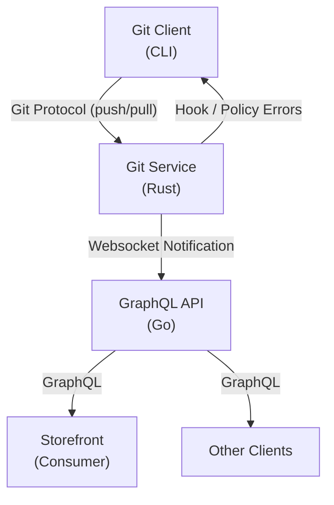

# GitStore - Agent-safe Catalogue Operations

> [!CAUTION]
> This project is in early development. The API and architecture are subject to change. Contributions and feedback are welcome, but expect breaking changes as we iterate.

Open-source Git-backed commerce platform where product catalogues are managed as plain files in Git instead of trapped inside a CMS/database admin interface.
Products, categories, and collections are Markdown files with structured front-matter. Changes can be created by developers, merchandisers, or AI agents, reviewed through normal Git workflows, checked by policy hooks where configured, and published through release tags. 
The platform already includes a Git service and GraphQL API, release-tag publishing, policy/schema processing in higher layers, and documentation.

The broader thesis is that commerce operations are becoming increasingly agentic. AI agents will generate product descriptions, update prices, localise catalogues, prepare campaigns, and coordinate merchandising changes. 
Existing commerce platforms were designed around human admin panels and opaque database state. GitStore makes commerce data auditable, reviewable, reversible, and automation-safe.

## Why Now

AI agents are becoming capable enough to modify commercial content, but businesses do not yet have safe operational rails for letting them touch production commerce data. Git already solved review, history, rollback, branching, and collaboration for code. 
GitStore applies those primitives to commerce catalogues, then exposes the result through headless APIs and admin workflows. The timing is right because headless commerce, GitOps, and AI-assisted operations are converging.

## Architecture

## Components

- **Git Service** (Rust): Built-in git repository transport with hook extension points and websocket notifications
- **GraphQL API** (Go): Headless API with Relay support

> **Admin**: For the optional web UI, see [docs/admin/](docs/admin/).

## Why This Works Well for Developers and AI Agents

- **Markdown-native catalogue authoring**: Products, categories, and collections are easy to create and edit as text files.
- **Git-native collaboration**: Branches, commits, diffs, code review, and tags become catalogue lifecycle tools.
- **Automation-friendly**: AI agents can generate and update catalogue content through file operations and standard git pushes.
- **Operational safety**: Hook and policy checks can run at push time, with clear errors before bad data reaches the runtime API.

## Quick Start

See [quickstart](docs/user-guide.md) for a Docker-based quick start.

## Contributing

See [developer guide](docs/developer-guide.md#development-setup) for instructions on setting up a local development environment, building from source, running tests, and contributing code.

## Documentation

- **Developer Guide**: [docs/developer-guide.md](docs/developer-guide.md)
- **Architecture**: [docs/architecture.md](docs/architecture.md)
- **API Reference**: [docs/api-reference.md](docs/api-reference.md)
- **User Guide**: [docs/user-guide.md](docs/user-guide.md)
- **Storefront**: [docs/storefront.md](docs/storefront.md)
- **GraphQL Contracts**: [shared/schemas/](shared/schemas/)

## License

AGPL-3.0 Licence. See [LICENCE](LICENSE) for details.
