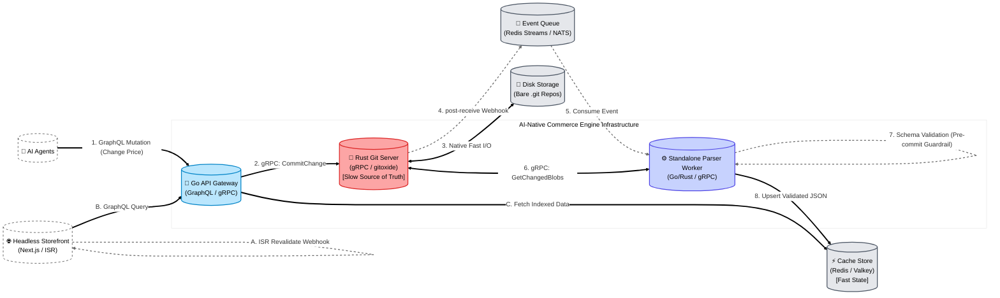
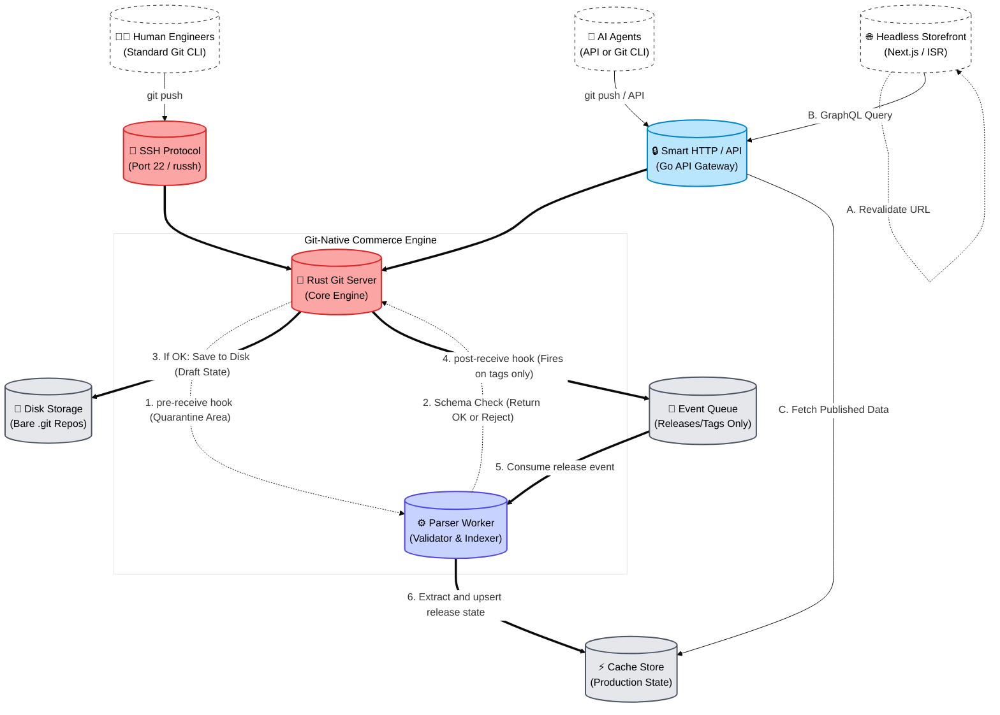

# Architecture

This document presents two end-to-end architecture options for the AI-native commerce engine. Both options treat Git as the authoritative system of record, then project customer-facing state into a fast read layer.

## System Goals

- Keep catalogue history auditable and reversible.
- Allow AI agents to perform safe, structured mutations.
- Serve storefront reads from low-latency indexed data.
- Decouple write acceptance from heavy validation and indexing work.

## Shared Building Blocks

Both proposals use the same core building blocks, arranged with different control points:

- **Actors**: AI agents, human engineers, and the storefront.
- **Control plane**: Go API gateway and/or Rust Git server.
- **Storage plane**: Bare Git repositories on disk as source of truth.
- **Distribution plane**: Event queue plus KV store for published read state.

## Implementation Baseline (Current Repository)

- `gitstore-api/`: Go API gateway, GraphQL surface, and gRPC client/server boundaries.
- `gitstore-git-service/`: Rust Git engine, receive hooks, and repository access logic.
- `shared/schemas/`: GraphQL schema contracts consumed by the API layer.
- `shared/proto/gitstore/git/v1/`: Canonical `.proto` definition for the gRPC Git service contract.

> **Admin**: For the optional web interface, see [`docs/admin/architecture.md`](admin/architecture.md).

### Service Boundary

The API gateway (`gitstore-api`) and the Git server (`gitstore-git-service`) communicate exclusively through gRPC on port `50051`. **No shared volume mount is required.** The API holds no local git state; every read (catalogue load) and every write (commit, delete, tag) is an RPC call to the Git service.

Key environment variables:

| Service                | Variable             | Purpose                                                |
|------------------------|----------------------|--------------------------------------------------------|
| `gitstore-api`         | `GITSTORE_GIT_GRPC`  | gRPC address of git-service (e.g. `git-service:50051`) |
| `gitstore-api`         | `GITSTORE_GIT_WS`    | WebSocket URL for catalogue-reload notifications       |
| `gitstore-git-service` | `GITSTORE_GRPC_PORT` | Port the gRPC server binds on (default `50051`)        |
| `gitstore-git-service` | `GITSTORE_DATA_DIR`  | Path to the bare repository directory                  |

These folders map directly to the control, storage, and distribution planes described below.

---

## Proposal 1 - API-Led Mutations with Asynchronous Indexing

Proposal 1 starts at the API boundary, commits to Git immediately, and then indexes validated state asynchronously.

### Top-Down Flow

1. **Entry**: AI agents call GraphQL mutations through the API gateway.
2. **Commit**: API gateway sends gRPC mutation requests to the Rust Git server.
3. **Persist**: Git server writes commits to disk repositories.
4. **Validate and index**: Post-receive events flow through queue and parser worker.
5. **Serve**: Storefront GraphQL queries read from the KV store.

### Implementation Focus

- **Request contract**: GraphQL mutations should include idempotency keys so retries do not create duplicate commits.
- **Commit metadata**: Persist actor identity, request ID, and schema version in commit message/footer for traceability.
- **Queue payload**: Emit repository path, commit SHA, changed blob paths, and correlation ID on each post-receive event.
- **Validation contract**: Parser worker validates changed blobs against the catalogue content schema (product/category/collection frontmatter) and returns structured errors.
- **KV write model**: Use deterministic keys (`catalog:{env}:{entity}:{id}`) and version stamps (`etag` or commit SHA).

### Architecture Diagram



### Responsibilities by Layer

- **Actors**
  - AI agents submit mutations and receive fast acknowledgements.
  - Storefront 
    - reads indexed catalogue state from KV for low-latency queries.
    - triggers ISR revalidation on webhook event from API.
- **Core services**
  - Go API gateway handles GraphQL writes and reads.
  - Rust Git server executes durable commit operations.
  - Parser worker validates changed blobs and writes read-optimised JSON.
- **Infrastructure**
  - Disk stores canonical Git history.
  - Queue carries asynchronous indexing work.
  - KV serves low-latency storefront reads.

### Operational Notes

- Write acknowledgements are fast because indexing is asynchronous.
- Validation failures are surfaced operationally without rewriting accepted Git commits.
- Multiple parser workers can scale out independently as event volume grows.

### Implementation Sequence

1. Wire GraphQL mutation handlers in `gitstore-api/` to a single gRPC `CommitChange` boundary.
2. Implement post-receive event publication in `gitstore-git-service/` with correlation IDs.
3. Add parser worker consumers that validate and upsert KV documents.
4. Add observability: mutation latency, queue lag, validation failure rate, and KV upsert latency.
5. Gate rollout with shadow indexing before switching storefront reads fully to KV.

---

## Proposal 2 - Git-Native Ingress with Tag-Gated Publishing

Proposal 2 starts at Git transport boundaries, executes hooks during receive, and only publishes customer-visible state on explicit release tags.

### Top-Down Flow

1. **Entry**: Engineers and AI agents push via SSH or Smart HTTP/API.
2. **Control**: Rust Git server executes pre- / post-receive hook pipelines.
3. **Persist draft**: Accepted changes are written to disk as draft state.
4. **Publish release**: Tag events trigger queue-to-parser publish workflow.
5. **Serve**: Storefront reads published state from KV and revalidates pages.

### Implementation Focus

- **Ingress policy**: Enforce branch/tag naming rules and signer checks in pre-receive hooks.
- **Hook contract**: Git service emits pre- / post-receive hook events; policy workers/API decide allow/deny semantics.
  ```bash
  $ git push origin main
  Enumerating objects: 5, done.
  Counting objects: 100% (5/5), done.
  Writing objects: 100% (3/3), 342 bytes | 342.00 KiB/s, done.
  Total 3 (delta 2), reused 0 (delta 0)
  remote: -------------------------------------------------
  remote: ❌ POLICY CHECK FAILED
  remote: -------------------------------------------------
  remote: Rule: validation-failed
  remote: Error: see hook diagnostics above.
  remote:
  remote: Please fix policy violations and push again.
  remote: -------------------------------------------------
  To ssh://git.yourstore.com/brand/catalog.git
  ! [remote rejected] main -> main (pre-receive hook declined)
  error: failed to push some refs to 'ssh://git.yourstore.com/brand/catalog.git'
  ```
- **Release contract**: Only tags matching a release pattern (for example `release/*` or `v*`) emit publish events.
- **Publication payload**: Include tag name, target commit SHA, repository, and release timestamp.
- **KV projection**: Parser materialises only tagged state, keeping draft commits invisible to storefront queries.

### Architecture Diagram



### Responsibilities by Layer

- **Actors**
  - Engineers and AI agents can both submit changes through Git-native channels.
  - Storefront reads only published release state.
- **Core services**
  - Rust Git server provides Git protocol transport, hook execution points, and repository integrity.
  - Parser worker validates and projects tagged releases into KV.
  - Go API endpoint remains available for GraphQL reads and controlled write APIs.
- **Infrastructure**
  - Disk stores draft and released Git history.
  - Queue carries release publication events.
  - KV contains only customer-visible published catalogue data.

### Operational Notes

- Release tags become the explicit publishing contract.
- Draft branch activity is isolated from customer-facing reads.
- Rollbacks can be executed by moving release tags and replaying publish events.

### Implementation Sequence

1. Implement SSH/HTTP receive entrypoints and pre-receive checks in `gitstore-git-service/`.
2. Persist accepted draft refs to disk and log audit metadata for every ref update.
3. Trigger publish events only from tag updates and process them in parser workers.
4. Update `gitstore-api/` read resolvers to fetch only published keys from KV.
5. Add release runbooks for promote, rollback, and replay operations.

---

## Choosing Between Proposals

- Choose **Proposal 1** if mutation throughput and agent ergonomics at the API layer are the primary priority.
- Choose **Proposal 2** if strict release control and Git-native operational workflows are the primary priority.
- In both cases, Git remains authoritative and KV remains the read-optimised projection layer.

